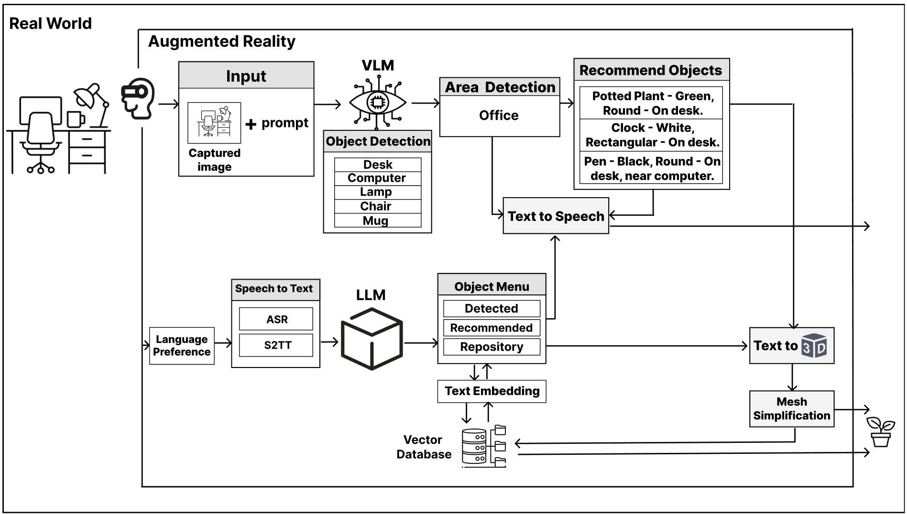

# Matrix: AI-Powered Real-Time 3D Object Generation for Augmented Reality

## Overview

**Matrix** is an advanced AI-powered framework that enables **real-time, context-aware 3D object generation and recommendation** within Augmented Reality (AR) environments. By leveraging cutting-edge generative AI models, vision-language models (VLMs), and multilingual speech interaction, Matrix empowers users to create and customize immersive AR experiences with natural voice commands.

This project integrates state-of-the-art AI technologies to seamlessly convert spoken language or images into interactive 3D objects placed within the user's physical environment — enhancing both functionality and aesthetic appeal.

---

## Key Features

- **Real-time Speech-to-3D Conversion**  
  Convert multilingual spoken commands into detailed 3D objects in under 50 seconds using optimized text-to-3D generative AI (Shap-E).

- **Context-Aware Object Recommendations**  
  Utilize Vision-Language Models (e.g., LLaVA) to analyze your AR surroundings, recommend contextually relevant objects, and suggest optimal placements based on spatial and aesthetic cues.

- **Interactive AR Environment**  
  Customize generated 3D objects through intuitive hand gestures for movement, rotation, and scaling directly in AR.

- **Image-to-3D Conversion with Object Isolation**  
  Select specific zones or objects from camera images using lasso selection to generate accurate 3D models even in complex scenes.

- **Efficient Model Simplification**  
  Mesh simplification reduces 3D model complexity to optimize rendering and performance on resource-constrained AR devices.

- **Semantic Search and Object Reuse**  
  Pre-generated object repository with vector database (ChromaDB) enables fast retrieval of similar models, minimizing redundant generation and GPU load.

- **Multilingual Support**  
  Speech-to-text and text-to-speech powered by SeamlessM4T and Coqui.ai support over 30 languages, enhancing accessibility.

- **Open-Source and Modular**  
  Designed for local deployment with interchangeable AI modules for flexible customization, ensuring data security and scalability.

---

## System Architecture

Matrix's core workflow involves:

1. Capturing images or speech commands via AR hardware (e.g., Microsoft HoloLens 2).
2. Processing inputs through Vision-Language Models to detect environment context and extract object details.
3. Generating or retrieving 3D models via text-to-3D generative AI (Shap-E) and semantic search.
4. Simplifying and integrating models into the AR environment for real-time user interaction.
5. Providing voice feedback and visual menus for seamless user control.

---

## Technical Highlights

- Uses **LLaVA** Vision-Language Model for multi-modal understanding.
- Implements **Shap-E** for rapid text-to-3D model generation.
- Employs **Mask R-CNN** for robust object detection and instance segmentation.
- Integrates **SeamlessM4T** for multilingual speech recognition and translation.
- Utilizes **ChromaDB** vector search for efficient object retrieval.
- Supports interaction via hand gestures for object manipulation in AR.
- Runs efficiently on mid-range GPUs like Nvidia Tesla T4.

---

## Installation & Usage

> *Instructions on how to set up the project locally or on AR hardware will be added here.*

---

## Evaluation & Results

- Achieved an average **System Usability Scale (SUS)** score of ~70, with higher usability ratings among experienced AR users.
- Demonstrated **object detection accuracy** above 88% in both indoor and outdoor environments.
- Reduced 3D object generation time to under 50 seconds compared to prior systems requiring 30+ minutes.
- Optimized GPU utilization for smooth real-time AR performance.

---

## Applications

- **Education:** Dynamic generation of 3D models for immersive teaching aids.
- **Design:** Context-aware interior and product design within AR spaces.
- **Accessibility:** Multilingual voice interfaces enabling inclusive user interactions.
- **E-commerce:** Real-time visualization of products in physical environments.

---

## Contributing

Contributions are welcome! Please open issues or submit pull requests for improvements, bug fixes, or new features.

---

## References

This project is based on the following key research papers:

- Behravan et al., *Generative AI for Context-Aware 3D Object Creation Using Vision-Language Models in Augmented Reality*, 2025.  
- Behravan & Gracanin, *From Voices to Worlds: Developing an AI-Powered Framework for 3D Object Generation in AR*, IEEE VR Workshop 2025.  
- Behravan et al., *Transcending Dimensions using Generative AI: Real-Time 3D Model Generation in Augmented Reality*, HCII 2025.

---

## License

This project is licensed under the MIT License - see the [LICENSE](LICENSE) file for details.

---

*Contact:* Majid Behravan (behravan@vt.edu)

